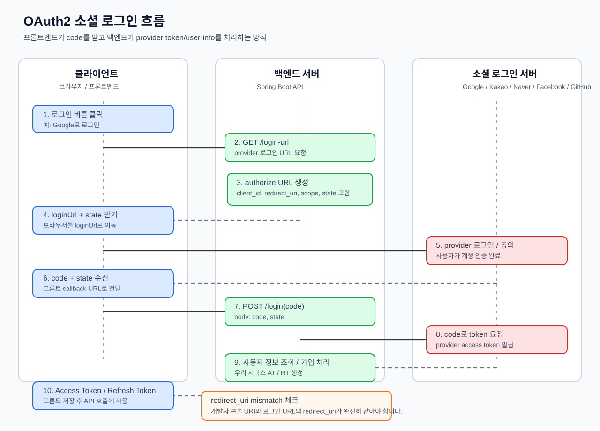

# Spring Boot Social Login Module

Spring Boot 기반 OAuth2 소셜 로그인 + JWT 인증 모듈입니다. Google, Kakao, Naver, Facebook, GitHub 로그인을 **같은 흐름**으로 처리하고, 로그인 성공 후 우리 서비스의 JWT Access/Refresh Token을 발급합니다.

- 서버: `http://localhost:8080`
- Swagger: `http://localhost:8080/swagger-ui.html`

## 아키텍처

`domain`(비즈니스)과 `global`(공통 인프라)로 나뉩니다. provider별 차이는 `global/oauth` 안쪽에 가두고, 바깥 레이어(Controller·Service)는 provider를 몰라도 되게 설계했습니다. 새 provider 추가 시 `global/oauth`(enum·설정·Client·UserInfo)만 손대면 됩니다.

```text
com.socialogin.module
├── domain
│   ├── auth          # OAuthController, OAuthService, dto, RefreshToken
│   └── user          # User, UserRole, UserRepository
└── global
    ├── oauth
    │   ├── OAuthProvider / OAuthProperties
    │   ├── client    # OAuthClient + AbstractOAuthClient + {Provider}OAuthClient + Factory
    │   └── userinfo  # OAuthUserInfo + {Provider}UserInfo (응답 → 공통 모델 변환)
    ├── jwt           # JwtTokenProvider (자체 JWT 발급/검증)
    ├── security      # SecurityConfig, JwtAuthenticationFilter
    ├── exception     # ErrorCode, GlobalExceptionHandler
    └── rsdata        # RsData (공통 응답 wrapper)
```

실행 흐름은 한 방향으로 흐릅니다.

```text
OAuthController → OAuthService → OAuthClientFactory → {Provider}OAuthClient
  → {Provider}UserInfo → UserRepository(로그인/가입) → JwtTokenProvider → TokenResponse
```

| 핵심 파일 | 역할 |
| --- | --- |
| `OAuthController` | HTTP API만 담당 (`/login-url`, `/authorize`, `/login`, legacy `/callback`) |
| `OAuthService` | 로그인 URL 생성, code 교환, 가입/로그인, JWT 발급 오케스트레이션 |
| `OAuthClient` / `AbstractOAuthClient` | authorize URL 생성, code→token 교환, user-info 조회 공통 로직 |
| `{Provider}OAuthClient` / `{Provider}UserInfo` | provider별 차이(scope 구분자, Naver state, GitHub email 보정 등)만 처리 |
| `JwtTokenProvider` | 우리 서비스 JWT Access/Refresh Token 생성·검증 |
| `SecurityConfig` / `JwtAuthenticationFilter` | 공개/인증 API 분리, `Bearer` 토큰 인증 |

## 로그인 흐름



1. 프론트엔드가 `GET /api/auth/oauth/{provider}/login-url` 로 로그인 URL 요청
2. 응답 `loginUrl`로 브라우저 이동 → 사용자가 provider 로그인/동의
3. provider가 callback(`/oauth/callback/{provider}?code=...`)으로 `code` 반환
4. 프론트엔드가 `code`만 `POST /api/auth/oauth/{provider}/login` 으로 전송
5. 백엔드가 code→token 교환, user-info 조회, `provider+providerId`로 로그인/가입 후 JWT 발급
6. 응답으로 `accessToken`/`refreshToken` 수신 → 이후 요청에 `Authorization: Bearer {token}`

> **2단계로 나눈 이유**: JWT가 callback URL·주소창에 노출되지 않도록, 토큰 발급은 `POST /login`에서만 합니다. provider가 직접 호출하는 backend callback(`GET .../callback`)은 빈 200만 반환합니다(브라우저가 주소창의 `code`를 보도록 204가 아닌 200 사용).

## 환경 변수

루트의 `.env.example`을 복사해 `.env`를 만듭니다. **secret이 든 `.env`는 커밋하지 않습니다**(`.gitignore` 처리됨).

```properties
APP_BASE_URL=http://localhost:8080
APP_FRONTEND_BASE_URL=http://localhost:8080
APP_CORS_ALLOWED_ORIGINS=http://localhost:8080

DB_URL=jdbc:mysql://localhost:3306/loginmodule?serverTimezone=Asia/Seoul&characterEncoding=UTF-8
DB_USERNAME=root
DB_PASSWORD=비밀번호

JWT_SECRET=최소_32바이트_이상의_시크릿
JWT_ACCESS_TOKEN_EXPIRATION=3600000
JWT_REFRESH_TOKEN_EXPIRATION=604800000

GOOGLE_CLIENT_ID=...
GOOGLE_CLIENT_SECRET=...
KAKAO_CLIENT_ID=...            # REST API 키 (JavaScript 키 아님)
KAKAO_CLIENT_SECRET=
NAVER_CLIENT_ID=...
NAVER_CLIENT_SECRET=...
FACEBOOK_CLIENT_ID=...
FACEBOOK_CLIENT_SECRET=...
FACEBOOK_GRAPH_API_VERSION=v21.0
GITHUB_CLIENT_ID=...
GITHUB_CLIENT_SECRET=...
```

provider endpoint(authorization/token/user-info URI, scope) 기본값은 공식 문서 기준으로 `application.yml`에 이미 설정되어 있어 보통 건드릴 필요가 없습니다.

## Redirect URI

기본 redirect URI는 `APP_FRONTEND_BASE_URL` 기준으로 만들어집니다.

| Provider | 개발자 콘솔에 등록 / 실제 요청 redirect_uri |
| --- | --- |
| Google | `http://localhost:8080/oauth/callback/google` |
| Kakao | `http://localhost:8080/oauth/callback/kakao` |
| Naver | `http://localhost:8080/oauth/callback/naver` |
| Facebook | `http://localhost:8080/oauth/callback/facebook` |
| GitHub | `http://localhost:8080/oauth/callback/github` |

**개발자 콘솔에 등록한 값과 요청의 `redirect_uri`가 글자 단위로 같아야 합니다.** 자주 틀리는 부분: `localhost`/`127.0.0.1`, `http`/`https`, 포트 누락, 끝 `/` 유무, 콘솔에서 입력만 하고 저장 안 함, `.env` 수정 후 서버 미재시작. 운영 배포 시 `APP_FRONTEND_BASE_URL`을 운영 도메인으로 바꾸거나 `{PROVIDER}_REDIRECT_URI`를 직접 지정합니다.

서버가 실제로 보내는 `redirect_uri` 확인:

```powershell
@('google','kakao','naver','facebook','github') | ForEach-Object {
  $url = [uri](Invoke-RestMethod "http://localhost:8080/api/auth/oauth/$_/login-url").data.loginUrl
  [pscustomobject]@{ provider = $_; redirect_uri = [System.Web.HttpUtility]::ParseQueryString($url.Query)['redirect_uri'] }
}
```

## 실행 & 테스트

```powershell
.\gradlew.bat bootRun        # 서버 실행 (http://localhost:8080)
.\gradlew.bat test           # 자동 테스트
```

자동 테스트는 현재 `ModuleApplicationTests.contextLoads()` 한 개로, Spring 컨텍스트가 정상적으로 떠야 통과합니다(Bean·`application.yml` 바인딩·DI가 깨지면 실패). 결과 확인:

- 콘솔: `BUILD SUCCESSFUL` / `BUILD FAILED`
- HTML 리포트: `build/reports/tests/test/index.html` (`Start-Process .\build\reports\tests\test\index.html`)

> `contextLoads`도 실제 컨텍스트를 띄우므로 `.env`에 DB·OAuth 값이 채워져 있어야 합니다.

**실제 로그인(end-to-end) 확인**: 서버 실행 후 Swagger에서 `GET .../login-url` → `loginUrl`로 provider 로그인 → callback URL의 `code`를 `POST .../login`에 전송 → `accessToken`/`refreshToken`이 내려오면 성공. 실패 시 응답 `error.code`(예: `INVALID_AUTHORIZATION_CODE`, `DUPLICATED_EMAIL_WITH_DIFFERENT_PROVIDER`)로 원인을 좁힙니다.

## 코드 읽는 순서

`application.yml` → `OAuthProvider`/`OAuthProperties` → `OAuthClient`/`AbstractOAuthClient`/`{Provider}OAuthClient` → `{Provider}UserInfo` → `OAuthService` → `OAuthController` → `JwtTokenProvider` → `JwtAuthenticationFilter`/`SecurityConfig`. 설정 → provider 구분 → 외부 API 호출 → 응답 변환 → 비즈니스 로직 → HTTP → JWT/Security 순으로 실제 실행 흐름과 거의 같습니다.

## 새 provider 추가 체크리스트

1. `OAuthProvider`에 enum 값 추가
2. `application.yml`에 `oauth.providers.{provider}` 설정 추가
3. `{Provider}UserInfo`로 응답 → `OAuthUserInfo` 변환
4. `{Provider}OAuthClient`를 `@Component`로 등록
5. provider 개발자 콘솔에 redirect URI 등록
6. `.\gradlew.bat compileJava` / `test` 실행
